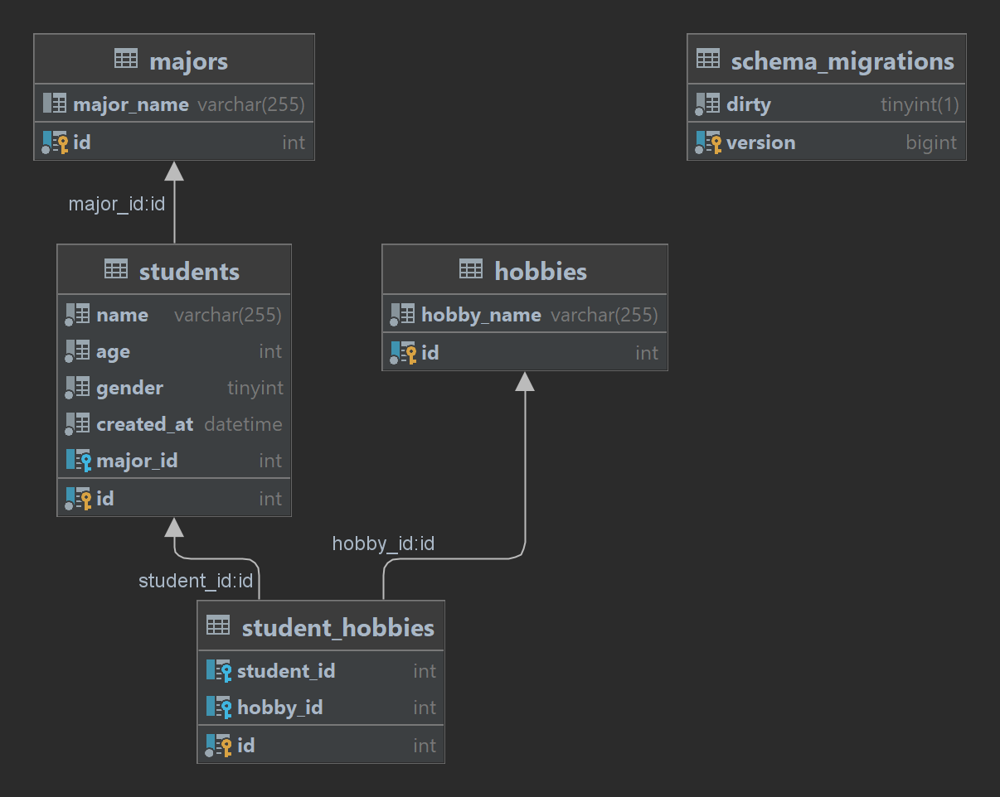

# Simple CRUD Student Restful API with Golang

## Authentication 
- Api Key Header 
`X-Api-Key =  RAHASIA`

## Live Demo
[link restful api]()

## Schema Database 

## API DOC
[Student API Test.postman_environment.json](Student%20API%20Test.postman_environment.json)

[Students API.postman_collection.json](Students%20API.postman_collection.json)
## API Specification
[apispec.json](apispec.json)

## Library
- [Driver My SQL](https://github.com/go-sql-driver/mysql)
- [HTTP Router](https://github.com/julienschmidt/httprouter)
- [Validation](https://github.com/go-playground/validator)
- [Migration](https://github.com/golang-migrate/migrate)
## Command
- `go mod init antoniusbunwijaya/student-api-go`
- `go get -u github.com/go-sql-driver/mysql`
- `go get -u github.com/julienschmidt/httprouter`
- `go get -u github.com/go-playground/validator`
- `go install -tags 'mysql' github.com/golang-migrate/migrate/v4/cmd/migrate@latest`
- `migrate`
- `migrate create -ext sql -dir db/migrations create_table_majors`
- `migrate create -ext sql -dir db/migrations create_table_students`
- `migrate create -ext sql -dir db/migrations create_table_hobbies`
- `migrate create -ext sql -dir db/migrations create_table_student_hobbies`
- `CREATE DATABASE student_api_go`
- `migrate -database "mysql://root@tcp(localhost:3306)/student_api_go" -path db/migrations up`

